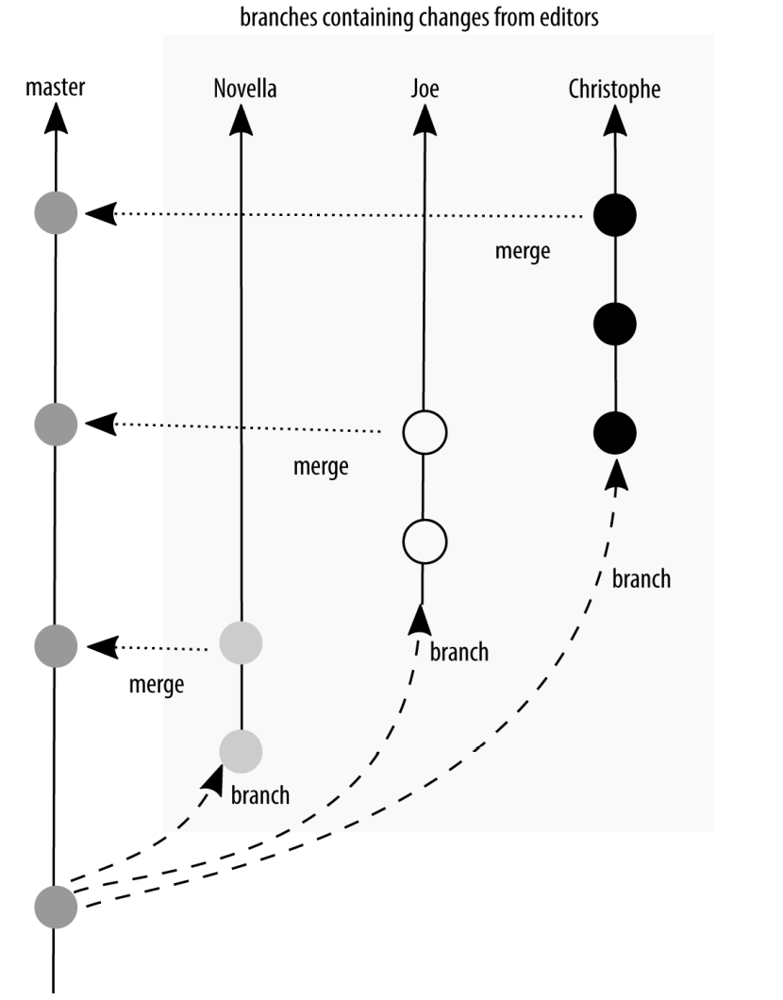
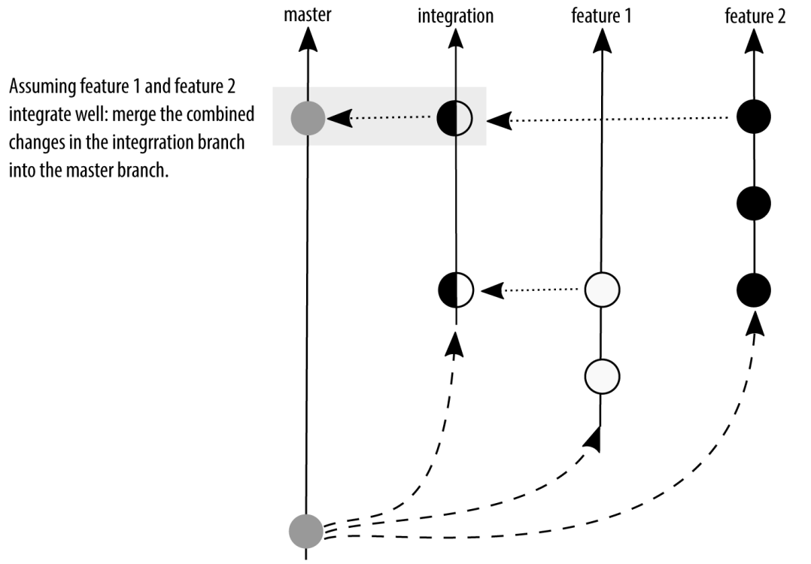
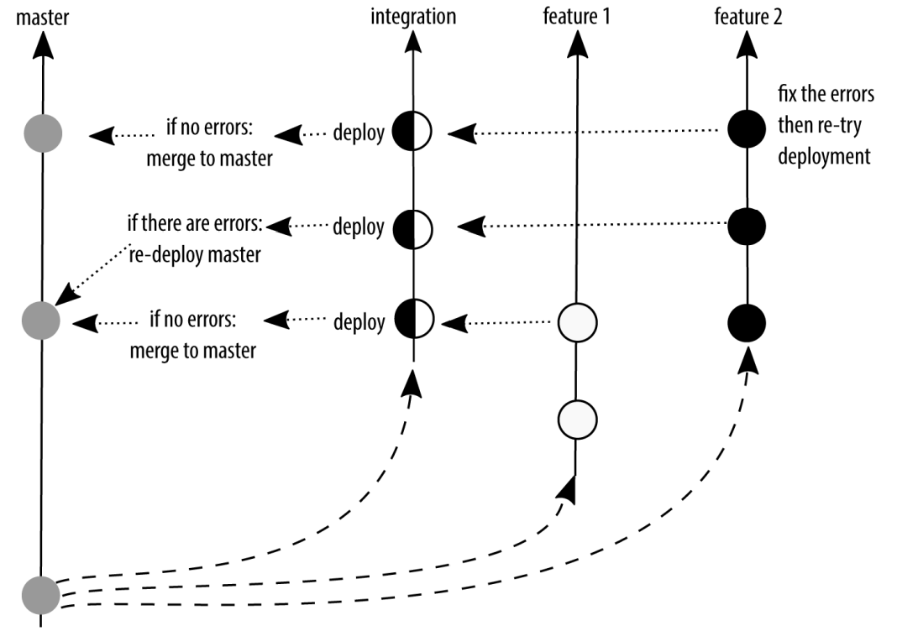
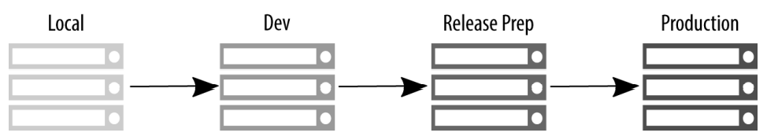
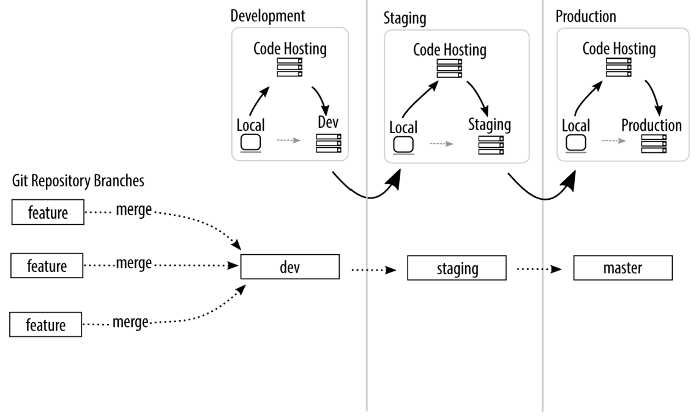
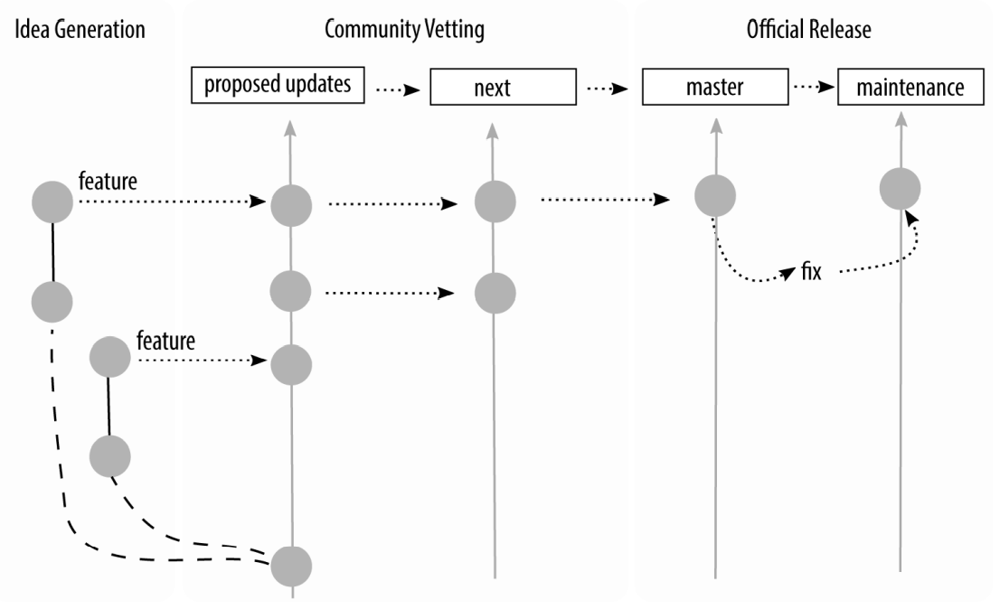
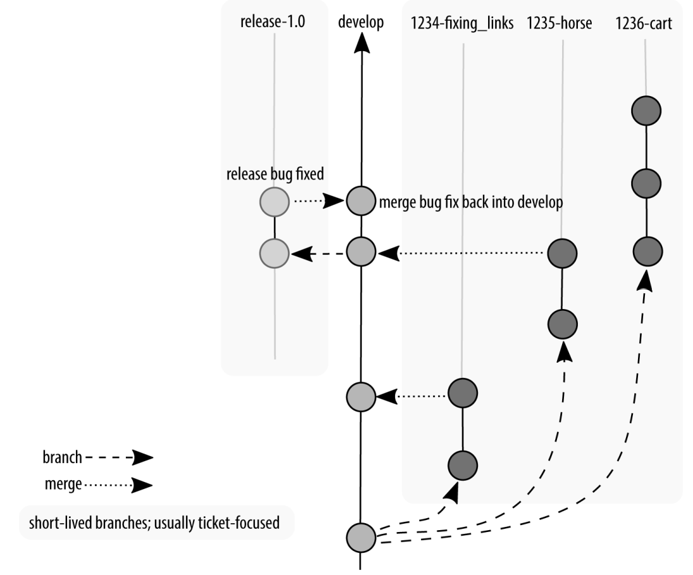
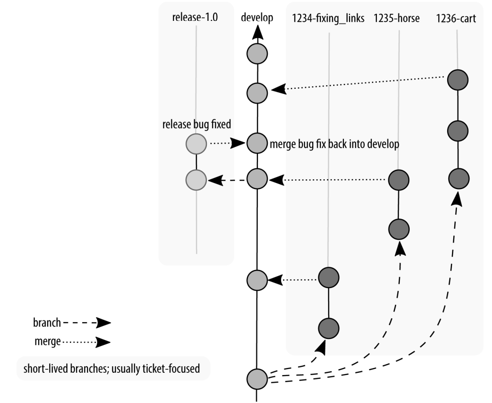
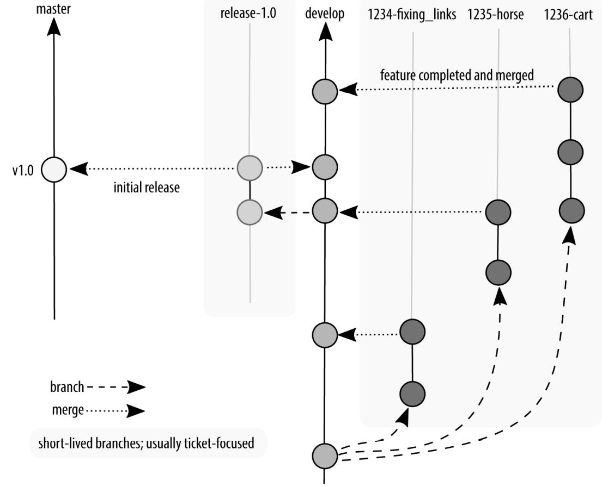

# Branching Strategies

In version control, a branch is a way to separate parallel thinking about how a piece of code might evolve. A branch always begins from a specific point in the code base.

The branching strategy that you use depends on your release management process. Branches allow you to change the files that are visible in the working directory for your project, and only one branch can be active at a time. Most branching strategies separate the work in your project by coarse ideas. An idea could be the version of your software for example, version 1, version 2, version 3. And spawning from those software versions you might have ideas that are in progress. These ideas are
generally separated into branches according to the name of the feature they represent. They might be a bug fix or a new feature, but they also represent whole ideas on a smaller scale.

## Mainline Branch Development

The easiest branching strategy to understand is the mainline branch method. In this strategy, there are fewer branches to work with. The developers are constantly committing their work into a single, central branch which is always in a deployment ready state. In other words, the main branch for the project should only contain tested work, and should never be broken.

As a team of one, I often work on tiny side projects that only just barely warrant having version control, such as writing an article for a magazine. In these cases, I commit all of my work in the default branch (named master by Git). If I have two unrelated ideas that I am working on, I might be lazy and choose to commit everything, or I might stash some of the work to save it for later. For these simple projects, it doesn’t warrant separating thinking into different branches in order to work efficiently.

**Mainline branch development: storing all commits to a single branch**


As the project matures, there will be more and more to think about, and it will get harder to keep track of ideas. I’ll start adding new branches as I think about new directions I might want to take my project in, but that aren’t as fully thought out as some of the other pieces I’m working on. Perhaps I’ll even expand my team and have
a reviewer or two with their own, independent branches. As the project grows in complexity (and team members), so will the number of branches. But they won’t all be active all the time.

**Mainline development with branching: branches separate the work being contributed by multiple people**



Perhaps it makes sense for your team to integrate their work into a central branch regularly, but only deploy work occasionally. As soon as you start collecting your work, you need to make a distinction between what you have locally, and what is being used on your production server. If all code is ready for deployment, it shouldn’t be too big of a deal to add a little fix and roll everything out. But what if you have changes committed in your repository that are only mostly finished? This is where we start to move away from a purely continuous deployment strategy, and toward multiple branches in a scheduled deployment strategy.

***There are several ```advantages``` to using a branching strategy that encourages regular integration of your work***

- There aren’t very many branches across the entire project. This results in less confusion about where a change disappeared into.
- Commits that are being made into the code base are relatively small. If there is a problem, it should be relatively quick to undo the mistake.
- There are fewer emergency fixes, because any code that is saved into the main branch is ready to be deployed. Deployments can often be stressful for developers as they hold their breath while code goes live in production and wait to hear back from the code’s users. With tiny frequent updates, this procedure becomes practiced, and finally automated to the point where it should be almost invisible to
the end user.

***There are ```disadvantages``` to using this strategy as well***

- The assumption is that the main branch contains deployment-ready code. If your team doesn’t have a testing infrastructure, it can be risky to assume that new code won’t break anything, especially as the project becomes more complex over time.
- The notion of a deployment is more appropriate for code that is automatically loaded onto a user’s device (for example, a website). It is less appropriate for software that must be downloaded and installed. While updates that fix problems are welcomed, even I would get annoyed if I had to download and reinstall an application on my phone on a daily basis.
- One of the ways developers can verify code on production is to hide the feature behind a flag or a flipper. Facebook, Flickr, and Etsy are all rumored to use this technique. The potential risk here is that code can be abandoned behind the flags,
resulting in a large technical debt for code that isn’t removed because it is hidden.

## Branch-Per-Feature Deployment

To overcome some of the limitations of the single branch strategy just described, you can introduce two additional types of branches: feature branches and integration branches. Technically, they aren’t different kinds of branches; it’s just the convention of what type of work is committed to the branch that differs.

In the branch-per-feature deployment strategy, all new work is done in a feature branch, which is as small as it can be to contain a whole idea. These branches are kept up to date with the work being done by other developers via an integration branch. When it is time to release software, the build master can selectively choose which features to include in the build and create a new integration branch for deployment. A build does not necessarily include all of the work completed since the last build.

**Branch-per-feature: feature branches are kept up to date via an integration branch**



By adding feature branches and an integration branch, you can continue to have deployment-ready code, but also a pause before deploying the code. The most popular description of this model is by [Adam Dymitruk.](http://dymitruk.com/blog/2012/02/05/branch-per-feature) A slightly earlier description of this model was by Scott Chacon and is named the [GitHub Flow](http://scottchacon.com/2011/08/31/github-flow.html). With a few minor
updates, this process is still used by GitHub today.

In the GitHub Flow branching model, anything in the master branch is deployable. When working on new code, GitHub Flow has the developers create a descriptively named feature branch and commit their work regularly to this branch. This branch is kept up to date with master and is regularly pushed to a branch on the shared repository, allowing others to see which features are actively being worked on. When developers think their work is complete, or when they need help with their work, they will
issue a pull request to the master branch. In the ticketing system, there will then be a conversation about the work that is being proposed.

Up to this point, the GitHub Flow is virtually the same as the Dymitruk model. Where they differ is in how the deployment happens. In the Dymitruk model, a build is made by selecting which features are ready to be incorporated. In the GitHub Flow model, once a pull request is accepted, the work is immediately ready to be deployed from its feature branch. This makes the strategy closer to mainline development. Originally, GitHub merged its feature branches into the master branch and then deployed the master branch. Nowadays, the feature branch is deployed and if there are no errors, it is merged into master as shown in Figure 3-4. This means that if there are problems with a feature branch, master can immediately be redeployed because it is proven to be in a working state.

**GitHub Flow: feature branches are deployed after a review and then merged into master**



***There are several ```advantages``` to using a branch-per-feature deployment strategy:***

- Much like mainline development, the focus is on rapid deployment of code.
- Unlike the mainline development, there is an optional build step. When the build step is used, there is the option to select which features should be incorporated into the master branch for deployment.

***There are ```disadvantages``` to using a branch-per-feature deployment branching strategy as well:***

- If code is kept on a feature branch, but it is not immediately rolled into master, there is an extra maintenance requirement for developers who need to keep their features up to date while waiting to be rolled into the deployed branch.
- The semantic naming of the branches helps those who are familiar with the system, but it also represents an insider language that can make onboarding more difficult if there are a lot of open features.
- There is now a housekeeping requirement for developers to remove old branches as they are rolled into master. This isn’t a large burden, but it is more than would be required from working out of a single master branch.

The branch-per-feature strategy offers a nice middle ground between mainline development and scheduled deployment. In some ways, scheduled deployment extends the branch-per-feature strategy, but with specific naming conventions.

## State Branching

Unlike the strategies up to this point, state branching introduces the idea of a location or snapshot for some of the branches. Often our deployment diagrams are overly simplified and suggest that code moves between environments, but generally this isn’t really how it happens. Instead, Figure shows the code is merged from one branch to another, and each of the branches is deployed to a specific environment. (Yes, we’ll talk about tagged releases later. Patience, grasshopper.) As Figure shows, there’s often a mismatch between the branch names that are used and the name of the environment we are deploying to. (What does master mean? Is it for production? For development? Are you sure?) This strategy was described as the GitLab Flow model.

**Deployment lies: code doesn’t really walk from the local server to the production server**



**The real deployment process uses a centralized code hosting system**



Through branch naming conventions, GitLab Flow makes it clear what code is going to be used in what environment, and therefore what conditions might need to be met before merging in commits. For example, you would clearly not merge untested code
into a branch named production. Alternatively, if you are shipping code to “the outside world” GitLab Flow suggests having release branches. Ideally, these release branches should follow [semantic versioning](https://semver.org/) conventions, although GitLab Flow does not explicitly require it.

An interesting variation on the state branching strategy is the [branch naming convention that the Git project uses](https://mirrors.edge.kernel.org/pub/software/scm/git/docs/gitworkflows.html). It has four named integration branches:

- ```maint```
This branch contains code from the most recent stable release of Git as well as additional commits for point releases (maintenance).
- ```master``` This branch contains the commits that should go into the next release.
- ```next``` This branch is intended to test topics that are being considered for stability in the master branch.
- ```pu``` The proposed updates branch contains commits that are not quite ready for inclusion.

The branches work much like a stacked pyramid. Each of the “lower” branches contain commits that are not present in the “higher” branches. maint has the fewest commits, and pu has the most commits. Once code has passed through the review process, it is incorporated into the next integration branch, getting closer to being incorporated into an official release.

**Integration branches used by the Git project**



***There are several ```advantages``` to using a state branching strategy:***

- Branch names are context specific and completely relevant to the work at hand.
- There is no guessing about the purpose of each branch, making it easier for people to select the right branch when merging their work.

***There are also ```disadvantages``` to using a state branching strategy:***

- It's not always obvious where to start a branch from without guidance.
- Because the branch names are extremely specific to the context of that team, it can be harder to get consistency across projects, making onboarding more difficult.

## Scheduled Deployment

Scheduled deployment branching is the most appropriate strategy to use if you do not have a completely automated test suite, and in any situation where you must schedule a deployment. This may be because you have deployment windows (for example, never after 4PM, and never on a Friday); or an additional regulatory gate you need to pass through (for example, iOS applications being deployed to the App Store). As soon as you involve humans in a review process, or someone else’s arbitrary constraints on your deployment process, there will inevitably be delays somewhere, and you will need a way to suspend your work while you wait for the humans.

Through the different types of branching strategies, we have been adding an increasing amount of complexity to the branching that takes place in a repository. We started with just one branch, and then we added features and an integration branch. In a scheduled deployment, we add to this again. However, scheduled deployments can get quite complex in their branching patterns. They should be built up over time, and
only as the complexity is warranted.

In this section, I will walk you through the progression of how the GitFlow branching strategy can be implemented by a team. GitFlow, the most popular implementation of this strategy, was first described by Vincent Driessen. It has been used by countless teams around the world to structure software projects. It can look very complex when
it is presented in its final form. Fortunately, though, software projects build up to this point; they don’t start out this way. If there are any parts of the GitFlow that which are not relevant for your team, you can omit them from your project.

Let’s walk through the model together.

At first your software project has a single branch, develop. From this branch, your programmers create a diverging branch and add their features. Figure shows that at this point, the diagram of GitFlow looks very similar to the previous models described in this chapter. In this case I will use the term “features” very broadly. A feature could actually be a bug fix, a refactoring, or indeed a completely new feature. Ideally when you’re working with a team, a feature will be described in a ticket before
you start your work, and the branch name will resemble the ticket name. For example, if you had a ticket “1234” that was a bug report to fix a broken link, and you were using the convention [ticket_id]-[terse_title], your branch name would be 1234-fixing_links.

**Development and feature branches used in GitFlow**


Your team works and works and works and then you get to a point where you say “No new features!” We’ll often refer to this as feature freeze. At this point, a new branch is created from the development branch, as shown in Figure, and the only things that can be committed to this branch are bug fixes. These bugs may include regressions in performance, security flaws, and other general bits and bobs that are now broken. In more traditional Waterfall team structures, this bug-fixing period would be led by a quality assurance team. In a more Agile team, a developer would follow the issues through the series of branches to deployment, and would even be responsible for testing the work of others.

**Feature freeze in GitFlow; only bug fixes are allowed**



Perhaps not all features were completed when the feature freeze happened, so there is still work being committed to the develop branch. And if bugs are reported, these bugs need to be incorporated “backward” into the develop branch as well.
Figure shows our first view of a branching diagram with code being merged in two different directions. The longer your quality assurance period, the more likely you are going to have work happening both on the develop branch and also on the
release branch.

**Development continues, but is not incorporated into the release branch**



After an amount of time in testing, it will be declared that all bugs have been found, and what remains is ready to be deployed. Congratulations! At this point, all code that has passed quality assurance testing is committed to a new branch, master, which is then tagged (like a bookmark) with the version of the software at that point. The software is then deployed. Your project manager gives you a heart-shaped candy, or maybe an animated GIF, and you get the rest of the day off. Good job, team! (If your project manager is not doing this, kindly send them my way and I’ll have a little chat with them on your behalf. We’re all friends here, it’s cool.)

Of course, reality dictates that sometimes bugs that need to be immediately fixed will sneak into the software. These hotfixes are so critical that a programmer should not go home for the evening before they are fixed. They are generally made by initiating a branch from the production branch, and when the hotfixes are released, they do not contain any additional work that has been happening since the last official release.

**Software is released by merging onto a new branch master, with a tag**



We’ve slowly built up these branches as we needed different places for work to continue happening. You don’t need to create all of these branches to start. In fact, it’s better if you don’t, because it ends up being more code to maintain. Once you’ve got code in production, and code in development, you end up having a lot of wheels turning on your branching graph, as shown in Figure. This can be overwhelming for a newcomer, but it will be a natural progression for any developer who has worked on the project from the beginning. And if you choose to use this convention, it will also feel familiar to any new developer who has worked with this model previously.

**A hotfix is made, rolled into master, and our release tag is now 1.0.1**


***There are several ```advantages``` to using a scheduled deployment strategy:***

- Scheduled deployment does not require an extensive testing infrastructure to start using.
- The process of building software, with phases for development, quality assurance, and production, is very common. This means GitFlow conventions will feel very familiar to software developers once they understand the process of how and where their typical tasks happen in the branching convention.
- By adhering to conventions, developers should always be able to determine from which branch they should begin their work.
- This is also a good model for versioned software, such as a product that you’d download from an app store where it is not appropriate to be deploying a new version every few days.

***There are ```disadvantages``` to using a scheduled deployment branching strategy as well:***

- There is a lot of cognitive overhead for developers who are new to software deployment and haven’t experienced the process of walking a product through each phase of development.
- If developers start their work from the wrong branch, it can be squirrelly to get everything back in sync.
- It’s not as trendy as continuous deployment. 

The scheduled deployment strategy offers the most rigid conventions about how code should be moved through the review gates. It is typically used when there is little to no automation for code review, and it is always present in some form for projects that are not using an automatic deployment scheme. Any time work is collated before being released, you will have at least some of the characteristics described in this section.

